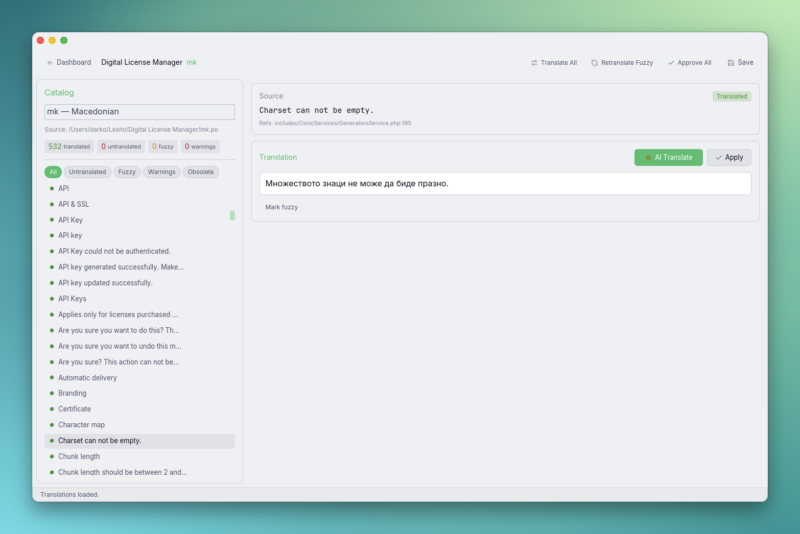

# Lexito

A desktop gettext translator for macOS and Linux, built with Rust and [Iced](https://iced.rs). Translate `.po`/`.pot` files with AI-powered translation via OpenAI, OpenRouter, or Anthropic APIs.



## Install

```bash
curl -fsSL https://raw.githubusercontent.com/gdarko/lexito/main/install.sh | bash
```

Works on macOS (Intel & Apple Silicon) and Linux (x86_64 & aarch64). On macOS it installs `Lexito.app` to `/Applications`. On Linux it installs the binary to `~/.local/bin` with a desktop entry and icon.

Run the same command again to upgrade to the latest version.

## Features

- Open `.po` files directly or `.pot` templates to start a locale-specific session
- Edit singular and plural translations with validation (placeholders, tags, plural forms)
- AI-powered single or batch translation via any OpenAI-compatible API
- Mark entries fuzzy or reviewed
- Save `.po` files and export `.mo` binaries
- Dark, Light, and System theme modes
- Project management with per-locale translation files
- Keyboard shortcuts for fast navigation

## Architecture

Three-crate workspace under `crates/`:

- **core** — catalog parsing, validation, project management
- **ai** — API client (OpenAI, OpenRouter, Anthropic), settings persistence, keychain storage
- **desktop** — Iced GUI application

## Local development

1. Install Rust 1.94.1 or let `rust-toolchain.toml` pin the toolchain automatically.
2. Run `cargo test --workspace`.
3. Run `cargo run -p lexito`.

## macOS app bundle

To build a proper `.app` with icon and About dialog:

```bash
./macos/bundle.sh
open target/release/Lexito.app
```

Requires `rsvg-convert` (`brew install librsvg`) for icon generation.

## License

MIT License. Copyright (c) 2025 Darko Gjorgjijoski.
